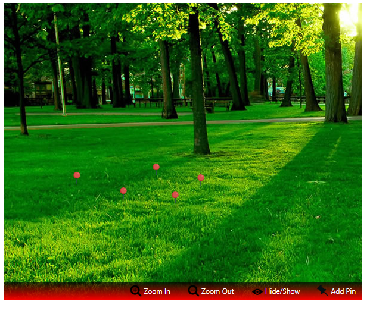

# NgxPinOverImage
This project is still being developed.
For more information please check this [site](https://yalcinmuhammed.github.io/ngx-pin-over-image/)

This project was generated with [Angular CLI](https://github.com/angular/angular-cli) version 1.6.5.

[]

## Usage
`app.module.ts` file should look likes to:
```
import { BrowserModule } from '@angular/platform-browser';
import { NgModule } from '@angular/core';
import { AppComponent } from './app.component';

import { PinOverImageModule } from './modules/pin-over-image/pin-over-image.module';

@NgModule({
  declarations: [
    AppComponent
  ],
  imports: [
    BrowserModule,
    PinOverImageModule
  ],
  providers: [],
  bootstrap: [AppComponent]
})
export class AppModule { }
```
In your component file:
```
import { PinOverImageComponent } from './modules/pin-over-image/pin-over-image.component'
import { OptionModel } from './modules/pin-over-image/models/option.model';
import { PinModel } from './modules/pin-over-image/models/pin.model';
import { PointModel } from './modules/pin-over-image/models/point.model';

@Component({...})
export class AppComponent {
  title = 'app';
  options:OptionModel = new OptionModel;
  pinList:PinModel[] = [];
  constructor(){

  }
  ngOnInit(){
      this.options.setBaseObject({
        imageUrl:"https://busraabaci.files.wordpress.com/2015/04/doga-2.jpg",
        outerDivWidth:600,
        outerDivHeight:500,
        addPinIconUrl:"https://upload.wikimedia.org/wikipedia/commons/thumb/6/63/Toicon-icon-stone-pin.svg/2000px-Toicon-icon-stone-pin.svg.png",
        hideShowIconUrl:"https://upload.wikimedia.org/wikipedia/commons/thumb/c/cf/OOjs_UI_icon_eye.svg/2000px-OOjs_UI_icon_eye.svg.png",
        zoomInIconUrl:"https://upload.wikimedia.org/wikipedia/commons/thumb/c/cd/Zoom_in_font_awesome.svg/2000px-Zoom_in_font_awesome.svg.png",
        zoomOutIconUrl:"https://upload.wikimedia.org/wikipedia/commons/thumb/b/bc/Zoom_out_font_awesome.svg/2000px-Zoom_out_font_awesome.svg.png",
        progressImgSrc:"https://upload.wikimedia.org/wikipedia/commons/a/ad/YouTube_loading_symbol_3_%28transparent%29.gif",
        pinBackground:"url(https://cdn4.iconfinder.com/data/icons/iconsimple-places/512/pin_1-128.png)",
        pinWidth:20,
        pinHeight:20,
        pinRadius:10,
        pinBorderRadius:10,
        addPinText:"Add Pin",
        hideShowText:"Hide/Show",
        zoomInText:"Zoom In",
        zoomOutText:"Zoom Out",
        textColor:"#fff",
        bottomDivBackground:"linear-gradient(#000000b0, red)"
    });

    let pin1 = new PinModel();
    pin1.id = 1;
    pin1.visibility = "visible";
    let p1:PointModel = new PointModel();
    p1.left = 250;
    p1.top = 250;
    pin1.point = p1;
    this.pinList.push(pin1);

  }

```

In your HTML file:
```html
<pin-over-image [optionData]="options" [pinListData]="pinList" ></pin-over-image>
```

## Development server

Run `ng serve` for a dev server. Navigate to `http://localhost:4200/`. The app will automatically reload if you change any of the source files.

## OptionModel Properties

```html
<table>
  <tr>
    <th>#</th><th>Property</th><th>Type</th><th>Description</th>
  </tr>
  <tr>
    <td>1</td><td>imageUrl</td><td>string</td><td>url of the background image</td>
  </tr>
  <tr>
    <td>2</td><td>outerDivWidth</td><td>number</td><td>width of the window of the image in pixels.</td>
  </tr>
  <tr>
    <td>3</td><td>outerDivHeight</td><td>number</td><td>height of the window of the image in pixels.</td>
  </tr>
  <tr>
    <td>4</td><td>addPinIconUrl</td><td>string</td><td>icon url for adding pin.</td>
  </tr>
  <tr>
    <td>5</td><td>hideShowIconUrl</td><td>string</td><td>icon url for hiding and showing pins.</td>
  </tr>
  <tr>
    <td>6</td><td>zoomInIconUrl</td><td>string</td><td>icon url for zooming in.</td>
  </tr>
  <tr>
    <td>7</td><td>zoomOutIconUrl</td><td>string</td><td>icon url for zooming out.</td>
  </tr>
  <tr>
    <td>8</td><td>progressImgSrc</td><td>string</td><td>url of progress loading icon.</td>
  </tr>
  <tr>
    <td>9</td><td>pinBackground</td><td>string</td><td>url (url('https//:...')) or color (#fff) of pin icon.</td>
  </tr>
  <tr>
    <td>10</td><td>pinWidth</td><td>number</td><td>width of pin icon in pixels.</td>
  </tr>
  <tr>
    <td>11</td><td>pinHeight</td><td>number</td><td>height of pin icon in pixels.</td>
  </tr>
  <tr>
    <td>12</td><td>pinRadius</td><td>number</td><td>radius of pin icon.</td>
  </tr>
  <tr>
    <td>13</td><td>pinBorderRadius</td><td>number</td><td>border radius of pin icon in pixels.</td>
  </tr>
  <tr>
    <td>14</td><td>addPinText</td><td>string</td><td>text for adding pin icon.</td>
  </tr>
  <tr>
    <td>15</td><td>hideShowText</td><td>string</td><td>text for hiding and showing pins icon.</td>
  </tr>
  <tr>
    <td>16</td><td>zoomInText</td><td>string</td><td>text for zooming in icon.</td>
  </tr>
  <tr>
    <td>17</td><td>zoomOutText</td><td>string</td><td>text for zooming out icon.</td>
  </tr>
  <tr>
    <td>18</td><td>textColor</td><td>string</td><td>text color of adding pin, hide and show pins, zoom in and zoom out icons.</td>
  </tr>
  <tr>
    <td>19</td><td>bottomDivBackground</td><td>string</td><td>background url (url('https://...')) or color div of the icons(add pin, hide/show pins, zoom in, zoom out)</td>
  </tr>
</table>
```

## Code scaffolding

Run `ng generate component component-name` to generate a new component. You can also use `ng generate directive|pipe|service|class|guard|interface|enum|module`.

## Build

Run `ng build` to build the project. The build artifacts will be stored in the `dist/` directory. Use the `-prod` flag for a production build.

## Running unit tests

Run `ng test` to execute the unit tests via [Karma](https://karma-runner.github.io).

## Running end-to-end tests

Run `ng e2e` to execute the end-to-end tests via [Protractor](http://www.protractortest.org/).

## Further help

To get more help on the Angular CLI use `ng help` or go check out the [Angular CLI README](https://github.com/angular/angular-cli/blob/master/README.md).
